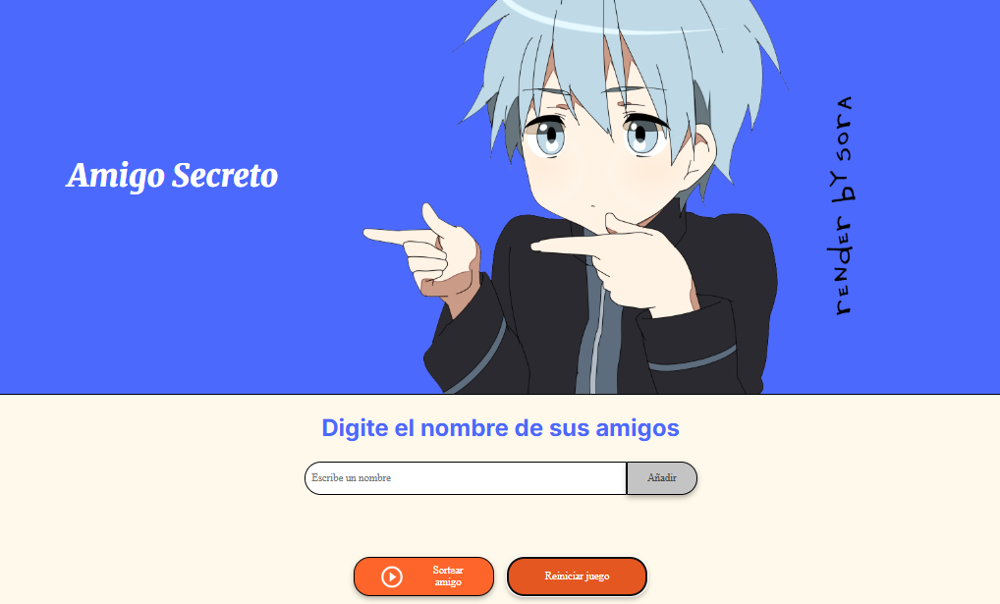

 # 🎁 Challenge Amigo Secreto 🎉

### Descripción

El proyecto "Amigo Secreto" es una aplicación web 💻 que permite a los usuarios ingresar una lista de nombres y sortear aleatoriamente un "amigo secreto" 🎮 sin repetir nombres hasta que todos hayan sido seleccionados. Ideal para organizar sorteos en reuniones, fiestas o eventos familiares. ✨

### Funcionalidades principales

📝 Ingreso dinámico de nombres a través de un campo de texto.

🎲 Sorteo aleatorio sin repetir nombres.

📋 Visualización de resultados en una lista separada.

🔄 Opción de reiniciar el juego para comenzar desde cero.

### Instrucciones de uso

Agregar nombres: Escribe un nombre en el campo de texto y haz clic en "Añadir".

Sortear un amigo: Haz clic en "Sortear amigo" para obtener un nombre aleatorio.

Reiniciar el juego: Presiona "Reiniciar juego" para limpiar todas las listas.

### Tecnologías utilizadas

💻 HTML

🎮 CSS

💻 JavaScript

### Contribuciones

¡Las contribuciones son bienvenidas! Si deseas mejorar el proyecto, haz un fork y envía un pull request.

### Autor

Victor Velazco Polanco

)
